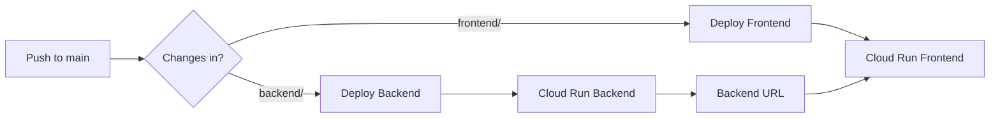

#  Trajetória - Plataforma de Autoconhecimento

Plataforma completa para testes de personalidade e orientação profissional com geração de relatórios em PDF.

## 📦 Estrutura do Projeto

```
Trajetoria/
├── frontend/                    # React + Vite
│   ├── src/
│   ├── .github/workflows/      # Deploy GitHub Pages
│   └── vite.config.js
├── backend/                     # Node.js + Express
│   ├── routes/
│   ├── services/
│   ├── utils/
│   ├── Dockerfile              # Container para Cloud Run
│   └── server.js
└── .github/
    └── workflows/
        └── deploy-backend.yml  # Deploy Cloud Run
```

## 🚀 Início Rápido

### Desenvolvimento Local

**1. Instalar Dependências**
```bash
# Frontend
cd frontend
npm install

# Backend
cd ../backend
npm install
```

**2. Iniciar Servidores**

Terminal 1 (Backend):
```bash
cd backend
npm run dev
```

Terminal 2 (Frontend):
```bash
cd frontend
npm run dev
```

**3. Acessar**
- Frontend: http://localhost:5173
- Backend: http://localhost:3001

---

## ☁️ Deploy em Produção

###  Configuração Escolhida: Opção 2
- **Frontend**: GitHub Pages (100% gratuito)
- **Backend**: Google Cloud Run (Free Tier)
- **Custo**: $0-1/mês

### 📖 Guias de Deploy

| Arquivo | Descrição |
|---------|-----------|
| **[COMECE-AQUI.md](COMECE-AQUI.md)** | 🚀 **Comece por aqui!** |
| **[GUIA-DEPLOY-OPCAO-2.md](GUIA-DEPLOY-OPCAO-2.md)** | 📖 Guia completo passo a passo |
| **[RESUMO-CONFIGURACAO.md](RESUMO-CONFIGURACAO.md)** | ⚡ Resumo rápido |
| **[DEPLOY-SETUP.md](DEPLOY-SETUP.md)** | 🔧 Detalhes técnicos |

### ⚡ Quick Start Deploy

1. **Configure Google Cloud** (Backend)
2. **Adicione Secrets no GitHub**
3. **Edite `backend/server.js`** com seu GitHub username
4. **Push para main** → Backend deploya automaticamente
5. **Edite `frontend/.env.production`** com URL do backend
6. **Ative GitHub Pages** em Settings
7. **Push para main** → Frontend deploya automaticamente

**📘 Siga o guia completo:** [COMECE-AQUI.md](COMECE-AQUI.md)

### Resumo Rápido

1. **Criar Projeto no Google Cloud**
2. **Ativar APIs**: Cloud Run, Artifact Registry, Cloud Build
3. **Criar Service Account** com permissões adequadas
4. **Adicionar Secrets no GitHub**:
   - `GCP_PROJECT_ID`
   - `GCP_SA_KEY`
5. **Push para main** → Deploy automático! 🎉

## 🛠️ Tecnologias

### Frontend
- React 18
- Vite
- Tailwind CSS
- React Router DOM

### Backend
- Node.js
- Express
- PDFKit
- CORS

### Deploy
- Google Cloud Run
- GitHub Actions
- Docker

## 📋 Funcionalidades

✅ 5 Testes de Autoconhecimento:
- Anamnese Inicial
- DISC Insight (Personalidade)
- Inteligências Múltiplas
- RIASEC (Orientação Profissional)
- Arquétipos

✅ Geração de Relatório PDF Profissional  
✅ Armazenamento Local (LocalStorage)  
✅ Design Responsivo  
✅ Dark Mode  
✅ Deploy Automático  

## 🌐 URLs de Produção

Após deploy:
- **Frontend**: https://trajetoria-frontend-xxxxx.run.app
- **Backend**: https://trajetoria-backend-xxxxx.run.app

## 📊 Fluxo de Deploy



## 🔒 Variáveis de Ambiente

### Frontend
```env
VITE_API_URL=https://trajetoria-backend-xxxxx.run.app
```

### Backend
```env
PORT=8080
NODE_ENV=production
```

## 📖 Documentação

- [DEPLOY-SETUP.md](DEPLOY-SETUP.md) - Guia completo de deploy
- [frontend/README.md](frontend/README.md) - Frontend específico
- [backend/README.md](backend/README.md) - API documentação

## 💰 Custos Estimados

Google Cloud Run Free Tier:
- 2M requests/mês
- 360,000 GB-seconds/mês
- **Custo estimado**: $0-5/mês para uso moderado

## 🤝 Contribuindo

1. Fork o projeto
2. Crie uma branch: `git checkout -b feature/nova-funcionalidade`
3. Commit: `git commit -am 'Adiciona nova funcionalidade'`
4. Push: `git push origin feature/nova-funcionalidade`
5. Pull Request

## 📝 License

All rights reserved © 2024 Trajetória

